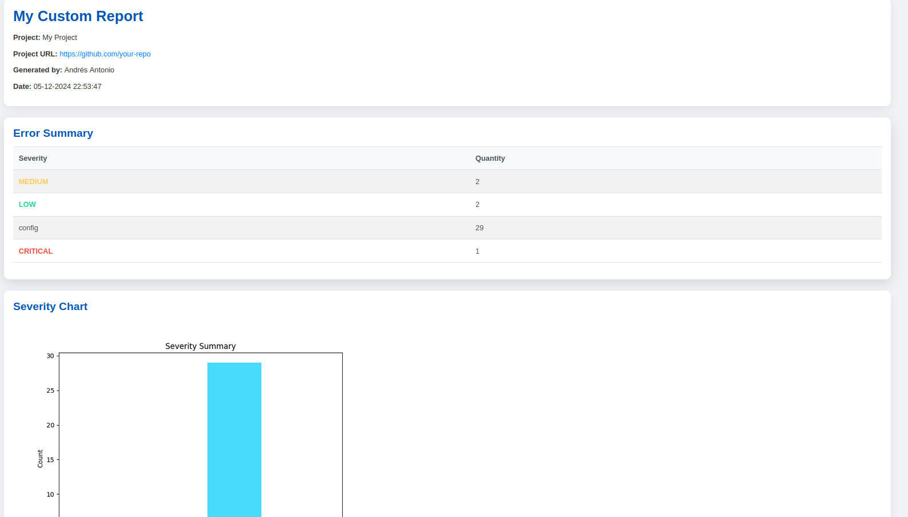
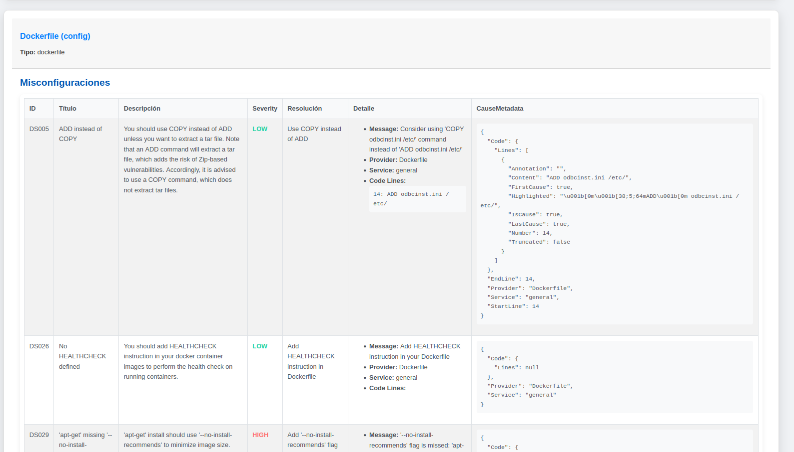

# Trivy HTML Report 📄

A CLI tool to convert Trivy JSON security reports into visually appealing and detailed HTML reports. This tool is designed to help developers and security teams easily analyze and share vulnerability information.

## Table of Contents

1. [Introduction](#introduction)
2. [Features](#features)
3. [Installation](#installation)
4. [Usage](#usage)
5. [Development](#development)
6. [Contributing](#contributing)
7. [License](#license)

## Features

- Converts Trivy JSON reports into a formatted HTML report.
- Generates a visual severity summary chart.
- Displays detailed vulnerability information.
- Includes additional raw data for comprehensive analysis.

## Installation

### Prerequisites

- Python 3.8 or higher
- Trivy (to generate the JSON report)

### Install

1. Clone the repository:
   ```bash
   git clone https://github.com/your-repo/trivy-html-report.git
   cd trivy-html-report
   ```
2. Install dependencies:
   ```bash
    pip install -r requirements.txt
   ```

3. Install the package in editable mode:
   ```bash
   pip install -e .
   ```
## Usage
   
   Run the following command to generate an HTML report from a Trivy JSON report:
   
   ```bash
   trivy-to-html --project-name "My Project" \
              --scan-author "name author" \
              --project-url "https://github.com/your-repo" \
              --input-json "./report.json" \
              --output-html "./report.html" \
              --report-title "My Security Report"
   ```

## Command Line Arguments

| Argument        | Description                                                                                  |
|------------------|----------------------------------------------------------------------------------------------|
| `--project-name` | The name of the project.                                                                     |
| `--scan-author`  | The name of the person or system generating the report.                                      |
| `--project-url`  | URL of the project (e.g., GitHub repository).                                                |
| `--input-json`   | Path to the Trivy JSON report file.                                                          |
| `--output-html`  | Path where the HTML report will be saved.                                                    |
| `--report-title` | *(Optional)* Title of the report. Defaults to "Trivy Security Report".                       |

## Example Output

### Severity Summary Chart


### HTML Report Preview



## Development

Run Tests

To run the tests, use:

```bash
pytest tests/
```

### Generate a Development JSON Report

If you don't have a Trivy JSON report, you can generate one for testing purposes:
```bash
trivy fs . --format json --output report.json
```

## Contributing

Contributions are welcome! Please submit a pull request or open an issue if you have suggestions for improvement.

## License

This project is licensed under the MIT License. See the LICENSE file for details.
